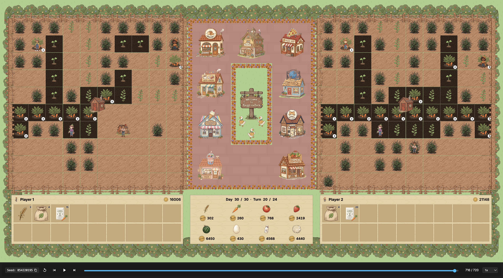

# Kaggriculture
Create an agent to play in this farming simulation and compete with others to maximize your income

## Overview
In this competition, you will design, build, and deploy an autonomous AI agent to manage a virtual farm, navigate a dynamic economy, and compete head-to-head against other agents on a live leaderboard.

## Description
This simulation competition is a turn-based farming game where two players compete on separate farms to see who can earn the most profit by the end of a 30-day season (720 turns).

Your agent acts as the main farmer and can strategically hire farm hands to scale up operations. To succeed, your agent must:

- Plant, water, fertilize, and harvest a variety of crops.
- Buy, feed, and care for animals to produce eggs, milk, and wool.
- Collect and utilize fertilizer to boost crop yields.
- Buy neighboring quadrants of land to expand your farm's footprint.
- Trade smart on a dynamic market where prices react to your sales and town demand.

Kaggriculture represents a highly complex environment that models the exact same dynamics found in real-world supply chains, dynamic market pricing, and industrial resource allocation under uncertainty. Underlying mechanics like scheduling resources, optimizing labor, adjusting to supply/demand price changes, and making long-horizon capital investments, serve as a high-fidelity sandbox for training AI to solve complex enterprise operations.

## Evaluation
Each day your team is able to submit up to 5 agents (bots) to the competition. Each submission will play Episodes (games) against other bots on the ladder that have a similar skill rating. Over time, skill ratings will go up with wins or down with losses, and even out with ties. To reduce the number of bots playing and ensure high-quality matching, only the latest 2 submissions are tracked. The latest 2 submissions are also used for final leaderboard evaluation.

Every bot submitted will continue to play episodes until the end of the competition, with newer bots playing a much more frequent number of episodes. On the leaderboard, only your best-scoring bot will be shown, but you can track the progress of all of your submissions on your Submissions page.

When you upload a submission, a Validation Episode is run where your agent plays against a copy of itself to ensure it runs without errors. If the episode fails, the submission is marked as Error, and you can download the agent logs to debug. Otherwise, the submission is initialized with a default rating and joins the matchmaking pool.

## Ranking System
Each submission is assigned a skill rating. When your agent plays an episode against an opponent:

Winning the match (having the most coins in the bank at the end of 720 turns) increases your skill rating, while losing decreases it.
The amount your rating changes depends on the rating difference between you and your opponent. Beating a highly-rated agent will boost your rating more than beating a lower-rated one.
Ties will generally pull ratings closer together.
The actual coin difference in a match does not affect the rating change—only the win, loss, or tie outcome matters.

## Final Evaluation
At the submission deadline, additional submissions will be locked. Games will continue to run for approximately two weeks to continue to reduce uncertainty, especially for new agents. A final Bradley-Terry tournament will be run on those episodes to produce the final leaderboard.